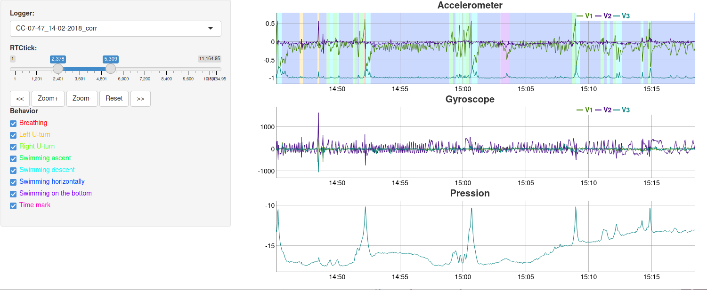

rblt 2.4.7 demo 

## download the git on your computer
```
git clone https://github.com/sg4r/lodemo.git
```
## From R studio
```
# set the work directory on your git repository 
setwd("~/lodemo")

# install rblt dev version
install.packages("devtools")
devtools::install_github("sg4r/rblt")

# load rblt library
library("rblt")

# visualise 2 Cats files + one with the behaviors
l=LoggerList$new()
l$add(LoggerCats$new("CC-07-47_14-02-2018_corr.h5",filebehavior="Behaviors_CC-07-47_14-02-2018.csv", besep=";", metricshow=c(T,T,F,F,T,F),besaturation=0.6))
l$add(LoggerCats$new("CC-07-48_26-05-2018_corr.h5",filebehavior="Behaviors_CC-07-48_26-05-2018.csv", besep=";", metricshow=c(T,T,F,F,T,F),besaturation=0.7))
lui=LoggerUI$new(l)
lui$gui()

```
### Screenshot
view main screen


### Online version
you can use a online version from shinyapps https://rblt.shinyapps.io/lodemo/ ou https://sg4r.shinyapps.io/lodemo/
# French Version
## rblt démo
Démo de l'utilisation de rblt 2.4.7

### récuperer un dataspace d'exemple
```
git clone https://github.com/sg4r/lodemo.git
```
### depuis R studio
```
# definir le repertoire de travail dans le repo git
setwd("~/lodemo")

# install rblt dev version
install.packages("devtools")
devtools::install_github("sg4r/rblt")

# load rblt library
library("rblt")

# visualiser 2 fichiers Cats
l=LoggerList$new()
l$add(LoggerCats$new("CC-07-47_14-02-2018_corr.h5",filebehavior="Behaviors_CC-07-47_14-02-2018.csv", besep=";", metricshow=c(T,T,F,F,T,F),besaturation=0.6))
l$add(LoggerCats$new("CC-07-48_26-05-2018_corr.h5",filebehavior="Behaviors_CC-07-48_26-05-2018.csv", besep=";", metricshow=c(T,T,F,F,T,F),besaturation=0.7))
lui=LoggerUI$new(l)
lui$gui()
```
